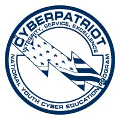

# Who Am I?

My Name Is Liam McCreery, this is my cybersecurity project portfolio. Here i've organized a few of my cybersecurity projects that i've been working on throughout highschool. My goal is to major in cybersecurity and to gain experience that may help me later in my educational career.

## Completed Projects

Neo Trinkey USB Rubber Ducky

CyberPatriot automation scripting

## Current Projects/Planned Projects

Deploy a SIEM and analyze logs (planned)

Python SSH monitoring Tool (in progess)

### Neo Trinkey USB Rubber Ducky

+ I used an Adafruit Neo Trinkey to create a malicious HID input device/bad usb

+ It runs a circuit python script that parsed a payload file and inputed keystrokes

+ I learned how malicious HID input devices work, and how to defend against them

+ I learned that devices like these also have a potential for automating basic security hardening tasks

+ I learned how much potential damage a device like mine could cause and how important it is to protect against them

#### Future Improvments

+ Develop potential Hardware/Software countermeasures to attacks like these

### CyberPatriot Scripting

+ I used Bash Powershell and CMD to automate security tasks in CyberPatriot

+ It Significantly reduced the time it took us to earn points

+ This Taught me not only how to use scripting languages but also how valuable automation is to security.

+ Taught me how scripting languages operate and what the appeal of using one would be

#### Future improvments

+ Learn how to automate a wider variety of actions

+ Learn to use CMD and Powershell more efficiently

### Python SSH Monitor

+ currently I am working on a python SSH logs monitor

+ It uses a regex search query and takes the IP address from a successful login attempt and count how many failed attempts and other suspicious activities took place.

### Deploy SIEM In Home Lab(planned)

.

+ First I plan to get an Ubuntu Server virtual machine running and install splunk free on it

+ Next I plan to use different common methods of exploitation to see how certain techniques attackers use affects system logs and what the siem does about the attacks

+ Finally I plan to take note of my findings learn from there. 

