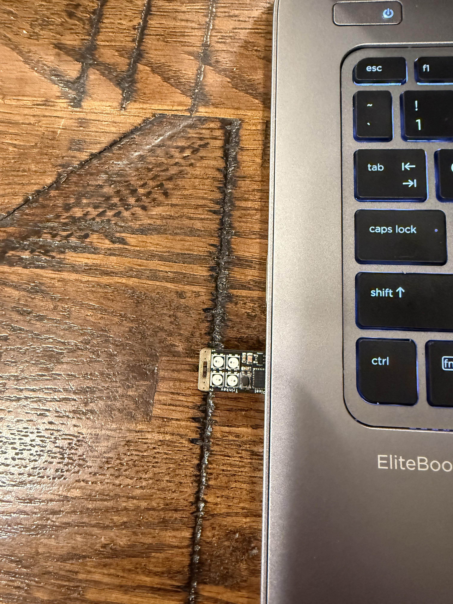

# Who Am I?

My Name Is Liam McCreery, this is my cybersecurity project portfolio. Here i've organized a few of my cybersecurity projects that i've been working on throughout highschool. My goal is to major in cybersecurity and to gain experience that may help me later in my educational career.

## Completed Projects

Neo Trinkey USB Rubber Ducky

CyberPatriot automation scripting


### Neo Trinkey USB Rubber Ducky

.
placeholder for image of my neo TRINKEY LOOK HERE!!!!!!

I used an Adafruit Neo Trinkey flashed CircuitPython to create a Bad USB/USB rubber ducky device. The goal of this project was to learn how malicious USB devices operate, and what they are capable of.
The motivation behind this project was to create a tool that I could use in a controlled setting to practice protecting a computer from malicious USB devices. The first thing I did with this project was that I flashed the Neo Trinkey with CircuitPython, the main issue that I faced here was
that I was unable to update the version of Circuit Python that was previously on the Neo Trinkey. To fix it I removed all of the data from the internal storage of the Neo Trinkey, which then allowed me to flash it with Circuit Python. I used the python script created by adafruit that would parse a 
payload file on the internal storage of the Trinkey, allowing the Trinkey to execute payloads very quickly. I learned that malicious HID input devices such as the Adafruit Neo Trinkey have huge potential to be misused, bad actors can plug a tool similar to mine into a PC and compromise it in a matter of seconds.
This is important since a misconfiguration in security could cause millions of dollars in damages to critical IT infrastructure with something that costs as much as a bag of beef jerky, making it incredibly important to mitigate the risk of a malicious cable causing damage to IT infrastructure.


#### Header 4

*   This is an unordered list following a header.
*   This is an unordered list following a header.
*   This is an unordered list following a header.

##### Header 5

1.  This is an ordered list following a header.
2.  This is an ordered list following a header.
3.  This is an ordered list following a header.

###### Header 6

| head1        | head two          | three |
|:-------------|:------------------|:------|
| ok           | good swedish fish | nice  |
| out of stock | good and plenty   | nice  |
| ok           | good `oreos`      | hmm   |
| ok           | good `zoute` drop | yumm  |

### There's a horizontal rule below this.

* * *

### Here is an unordered list:

*   Item foo
*   Item bar
*   Item baz
*   Item zip

### And an ordered list:

1.  Item one
1.  Item two
1.  Item three
1.  Item four

### And a nested list:

- level 1 item
  - level 2 item
  - level 2 item
    - level 3 item
    - level 3 item
- level 1 item
  - level 2 item
  - level 2 item
  - level 2 item
- level 1 item
  - level 2 item
  - level 2 item
- level 1 item

### Small image


### Large image


### Definition lists can be used with HTML syntax.

<dl>
<dt>Name</dt>
<dd>Godzilla</dd>
<dt>Born</dt>
<dd>1952</dd>
<dt>Birthplace</dt>
<dd>Japan</dd>
<dt>Color</dt>
<dd>Green</dd>
</dl>

```
Long, single-line code blocks should not wrap. They should horizontally scroll if they are too long. This line should be long enough to demonstrate this.
```

```
The final element.
```
